# Kinetic Green EV Dashboard - Complete Application Flowchart

## Mermaid Flowchart Code

```mermaid
flowchart TD
    Start([User Visits Application]) --> LoginPage[Login Page]
    
    LoginPage --> LoginUI{Login Interface}
    LoginUI --> VisualSection[65% Visual Section<br/>- 3D Animated Sphere<br/>- Live Stats Badges<br/>- CO2 Saved Counter<br/>- Active Vehicles Count<br/>- Rotating Slogans]
    LoginUI --> FormSection[35% Form Section<br/>- Username Input<br/>- Password Input<br/>- Remember Me<br/>- Forgot Password Link<br/>- Demo Credentials]
    
    FormSection --> LoginAttempt{Login Attempt}
    LoginAttempt -->|Success| RoleCheck{Determine User Role}
    LoginAttempt -->|Failure| LoginError[Display Error Message]
    LoginError --> LoginPage
    
    FormSection --> ForgotPwd[Forgot Password Flow]
    ForgotPwd --> EmailInput[Enter Email]
    EmailInput --> SendReset[Send Reset Link]
    SendReset --> LoginPage
    
    RoleCheck -->|SUPER_ADMIN| AdminDash[Super Admin Dashboard]
    RoleCheck -->|OEM| OEMDash[OEM Dashboard]
    RoleCheck -->|RND| RNDDash[R&D Dashboard]
    RoleCheck -->|DEALER| DealerDash[Dealer Dashboard]
    RoleCheck -->|SERVICE| ServiceDash[Service Dashboard]
    RoleCheck -->|FLEET| FleetDash[Fleet Dashboard]
    RoleCheck -->|SALES| SalesDash[Sales Team Dashboard]
    RoleCheck -->|FLEET_DRIVER| DriverDash[Fleet Driver Dashboard]
    RoleCheck -->|USER| UserDash[User Dashboard]
    
    AdminDash --> MainLayout[Main Application Layout]
    OEMDash --> MainLayout
    RNDDash --> MainLayout
    DealerDash --> MainLayout
    ServiceDash --> MainLayout
    FleetDash --> MainLayout
    SalesDash --> MainLayout
    DriverDash --> MainLayout
    UserDash --> MainLayout
    
    MainLayout --> Header[Header Component<br/>- Page Title<br/>- Search Bar<br/>- Dark Mode Toggle<br/>- Notifications Bell<br/>- User Profile Menu]
    MainLayout --> Sidebar[Sidebar Navigation<br/>Role-Based Menu Items]
    MainLayout --> Content[Main Content Area<br/>Dynamic Based on Selection]
    
    Header --> ProfileMenu{User Profile Actions}
    ProfileMenu --> ViewProfile[View Profile]
    ProfileMenu --> Settings[Settings]
    ProfileMenu --> Logout[Logout]
    Logout --> ConfirmLogout{Confirm Logout?}
    ConfirmLogout -->|Yes| ClearSession[Clear Session]
    ClearSession --> LoginPage
    ConfirmLogout -->|No| MainLayout
    
    Sidebar --> MenuDashboard[Dashboard]
    Sidebar --> MenuAddVehicle[Add Vehicle]
    Sidebar --> MenuDealer[Dealer Management]
    Sidebar --> MenuTracking[Live Tracking]
    Sidebar --> MenuInsights[Vehicle Insights]
    Sidebar --> MenuFaults[Fault Analysis]
    Sidebar --> MenuReports[Reports]
    Sidebar --> MenuDevices[Device Management]
    Sidebar --> MenuECUs[ECUs Submenu]
    Sidebar --> MenuFOTA[FOTA Updates]
    Sidebar --> MenuSupport[Support & Connect]
    Sidebar --> MenuConfigure[Configure]
    Sidebar --> MenuEnterprise[Enterprise Settings]
    
    MenuDashboard --> Dashboard[Dashboard Page<br/>- Device Stats Cards<br/>- Sales Progress<br/>- Environmental Impact<br/>- Quick Actions<br/>- Performance Charts<br/>- Recent Alerts<br/>- Recent Trips]
    
    MenuAddVehicle --> AddVehicleCheck{Role Check}
    AddVehicleCheck -->|Authorized| AddVehiclePage[Add Vehicle Form]
    AddVehicleCheck -->|Unauthorized| AccessDenied[Access Denied]
    
    AddVehiclePage --> VehicleForm[Vehicle Registration<br/>- Vehicle Type<br/>- VIN Number + QR Scanner<br/>- Model Selection<br/>- VCU Number + QR Scanner<br/>- Battery Serial + QR Scanner<br/>- Battery Capacity<br/>- IMEI + QR Scanner<br/>- Customer Details]
    VehicleForm --> ValidateVehicle{Validate Form}
    ValidateVehicle -->|Valid| SaveVehicle[Save Vehicle to Fleet]
    ValidateVehicle -->|Invalid| ShowErrors[Show Validation Errors]
    ShowErrors --> VehicleForm
    SaveVehicle --> VehicleSuccess[Vehicle Added Successfully]
    VehicleSuccess --> Dashboard
    
    MenuDealer --> DealerCheck{Role Check}
    DealerCheck -->|Super Admin/OEM/RND| DealerMgmt[Dealer Management Page]
    DealerCheck -->|Dealer| OwnDealerView[Own Dealership View]
    DealerCheck -->|Other Roles| AccessDenied
    
    DealerMgmt --> DealerGrid[Dealer Cards Grid<br/>- Dealer Profiles<br/>- Contact Info<br/>- Established Year]
    DealerGrid --> DealerInventory[Vehicle Inventory<br/>- 2-Wheeler Tab<br/>- 3-Wheeler Tab<br/>- VIN/VCU/Battery/IMEI<br/>- Status/Customer Info]
    DealerMgmt --> AddDealerBtn[Add New Dealer Button]
    AddDealerBtn --> AddDealerModal[Add Dealer Modal<br/>- Name<br/>- Location<br/>- Contact<br/>- Email<br/>- Established Year]
    AddDealerModal --> ValidateDealer{Validate Form}
    ValidateDealer -->|Valid| SaveDealer[Save Dealer]
    ValidateDealer -->|Invalid| DealerErrors[Show Errors]
    DealerErrors --> AddDealerModal
    SaveDealer --> DealerMgmt
    
    MenuTracking --> TrackingCheck{Role Check}
    TrackingCheck -->|Authorized| LiveTracking[Live Tracking Page]
    TrackingCheck -->|Unauthorized| AccessDenied
    
    LiveTracking --> MapView[Interactive Map<br/>Leaflet.js Integration]
    LiveTracking --> VehicleList[Vehicle List Sidebar<br/>Search/Filter]
    MapView --> VehicleMarkers[Vehicle Markers<br/>🟢 Active<br/>🟡 Idle<br/>🔴 Maintenance<br/>⚡ Charging]
    VehicleList --> SelectVehicle[Click Vehicle]
    SelectVehicle --> ZoomToLocation[Zoom to Location<br/>Show Details Popup]
    
    LiveTracking --> FilterByRole{Filter Data by Role}
    FilterByRole -->|Super Admin| AllVehicles[All 25,000+ Vehicles]
    FilterByRole -->|Fleet| FleetVehicles[Assigned Fleet Vehicles]
    FilterByRole -->|User| OwnVehicle[Own Vehicle Only]
    
    MenuInsights --> InsightsPage[Vehicle Insights Page]
    InsightsPage --> SelectVehicleInsight[Select/Filter Vehicle]
    SelectVehicleInsight --> ShowMetrics[Display Metrics<br/>- Total Trips/Distance<br/>- Avg Speed/Efficiency<br/>- Uptime %<br/>- Maintenance Cost<br/>- Revenue<br/>- Utilization Rate]
    ShowMetrics --> HealthScores[Health Scores<br/>- Overall Health<br/>- Battery Health<br/>- Tire Condition<br/>- Brake Health]
    ShowMetrics --> ServiceSchedule[Service Schedule<br/>- Last Service<br/>- Next Due Date]
    ShowMetrics --> TrendCharts[Monthly Trend Charts<br/>- Trips/Distance/Revenue]
    ShowMetrics --> Environmental[CO2 Saved]
    
    MenuFaults --> FaultAnalysis[Fault Analysis Page]
    FaultAnalysis --> FaultSummary[Summary Dashboard<br/>- Total Faults: 73<br/>- Active: 35<br/>- Resolved: 33<br/>- Critical: 11<br/>- Avg Resolution: 4.6h]
    FaultAnalysis --> FaultCategory[By Category Pie Chart<br/>- Battery & Power 27.7%<br/>- Communication 21.5%<br/>- Motor & Drive 18.5%<br/>- Braking 13.8%<br/>- Sensors 12.3%<br/>- Other 6.2%]
    FaultAnalysis --> FaultSeverity[By Severity Bar Chart<br/>- High 37%<br/>- Medium 41.1%<br/>- Low 21.9%]
    FaultAnalysis --> TopFaults[Top Faults Table<br/>- Code/Description<br/>- Occurrences<br/>- Affected Vehicles<br/>- Resolution Time]
    FaultAnalysis --> MonthlyTrend[Monthly Trend Chart<br/>Total vs Resolved vs Active]
    FaultAnalysis --> VehicleDistribution[Vehicle Distribution<br/>Fault Count per Vehicle]
    
    MenuReports --> ReportsPage[Reports Page]
    ReportsPage --> ReportType{Select Report Type}
    ReportType --> VehiclePerf[Vehicle Performance]
    ReportType --> FleetAnalytics[Fleet Analytics]
    ReportType --> DealerReports[Dealer Reports]
    ReportType --> FaultReports[Fault Analysis]
    ReportType --> EnvReports[Environmental Impact]
    
    ReportsPage --> ReportFilters[Filter Options<br/>- Date Range<br/>- Vehicle Selection<br/>- Dealer Selection<br/>- Format]
    ReportFilters --> GenerateReport[Generate Report]
    GenerateReport --> ReportActions{Report Actions}
    ReportActions --> PreviewReport[Preview Report]
    ReportActions --> DownloadPDF[Download PDF]
    ReportActions --> ExportExcel[Export Excel/CSV]
    ReportActions --> ScheduleReport[Schedule Recurring]
    
    MenuDevices --> DeviceCheck{Role Check}
    DeviceCheck -->|Authorized| DeviceMgmt[Device Management Page]
    DeviceCheck -->|Unauthorized| AccessDenied
    
    DeviceMgmt --> DeviceList[IoT Device Tracking<br/>- IMEI Registration<br/>- SIM Card Management<br/>- Network Status<br/>- Device Mapping<br/>- Firmware Version<br/>- Data Plan Monitoring]
    
    MenuECUs --> ECUCheck{Role Check}
    ECUCheck -->|Super Admin/RND/Service| ECUSubmenu[ECUs Submenu]
    ECUCheck -->|Unauthorized| AccessDenied
    
    ECUSubmenu --> MCUData[MCU Data<br/>Motor Control Unit<br/>- Temperature<br/>- RPM<br/>- Power Output<br/>- Efficiency<br/>- Cooling Status]
    ECUSubmenu --> VCUData[VCU Data<br/>Vehicle Control Unit<br/>- Drive Mode<br/>- Throttle Position<br/>- Regen Braking<br/>- Speed/Torque<br/>- Motor Control]
    ECUSubmenu --> BMSData[BMS Data<br/>Battery Management<br/>- Cell Voltages<br/>- SOC/SOH<br/>- Temperature<br/>- Current Flow<br/>- Fault Alarms]
    ECUSubmenu --> HeatMaps[Heat Maps<br/>- Thermal Imaging<br/>- Hot Spot Detection<br/>- Temperature Distribution]
    
    MenuFOTA --> FOTAPage[FOTA Updates Page]
    FOTAPage --> AvailableUpdates[Available Updates List<br/>- Firmware Version<br/>- Release Date<br/>- Compatible Vehicles<br/>- Description]
    FOTAPage --> DeployUpdate[Update Deployment<br/>- Select Target Vehicles<br/>- Schedule Time<br/>- Review Changes<br/>- Initiate Update]
    FOTAPage --> UpdateStatus[Update Status Tracking<br/>- Pending<br/>- In Progress<br/>- Completed<br/>- Failed]
    FOTAPage --> Rollback[Rollback Capability<br/>Revert to Previous Version]
    
    MenuSupport --> SupportCheck{Role Check}
    SupportCheck -->|User/Dealer| SubmitComplaint[Submit Complaint Form<br/>- Customer Name<br/>- License Plate<br/>- VIN Number<br/>- Title<br/>- Description<br/>- Contact Options]
    SupportCheck -->|Admin/Service/RND| ManageComplaints[Manage Complaints<br/>- View All<br/>- Respond<br/>- Change Status<br/>- Assign Priority<br/>- Assign to Team]
    SupportCheck -->|OEM| ReadOnlyView[Read-Only View<br/>- View Complaints<br/>- Dashboard Stats<br/>- Search/Filter<br/>- View Responses<br/>Cannot Modify]
    
    SubmitComplaint --> ComplaintSubmitted[Complaint Submitted]
    ComplaintSubmitted --> Dashboard
    
    ManageComplaints --> ComplaintDashboard[Complaint Dashboard<br/>- Total Count<br/>- Open/Pending/Resolved<br/>- Search/Filter]
    ComplaintDashboard --> ComplaintActions{Complaint Actions}
    ComplaintActions --> ViewDetails[View Details]
    ComplaintActions --> RespondCustomer[Respond to Customer]
    ComplaintActions --> ChangeStatus[Change Status<br/>Open/In Progress/Resolved/Closed]
    ComplaintActions --> SetPriority[Set Priority<br/>Low/Medium/High/Critical]
    ComplaintActions --> AssignTeam[Assign to Team]
    
    MenuConfigure --> ConfigureCheck{Role Check}
    ConfigureCheck -->|Authorized| ConfigurePage[Configure Page]
    ConfigureCheck -->|Unauthorized| AccessDenied
    
    ConfigurePage --> GeneralSettings[General Settings<br/>- Dashboard Layout<br/>- Data Refresh Intervals<br/>- Language Preferences]
    ConfigurePage --> NotificationSettings[Notification Settings<br/>- Email Notifications<br/>- Push Notifications<br/>- Alert Thresholds<br/>- Frequency]
    ConfigurePage --> SecuritySettings[Security Settings<br/>- Two-Factor Auth<br/>- Session Timeout<br/>- Password Policy]
    ConfigurePage --> RegionalSettings[Regional Settings<br/>- Units km/miles<br/>- Temperature °C/°F<br/>- Currency]
    ConfigurePage --> SaveConfig[Save Changes]
    SaveConfig --> Dashboard
    
    MenuEnterprise --> EnterpriseCheck{Role Check}
    EnterpriseCheck -->|Super Admin Only| EnterprisePage[Enterprise Settings]
    EnterpriseCheck -->|Unauthorized| AccessDenied
    
    EnterprisePage --> OrgSettings[Organization Settings<br/>- Company Info<br/>- Branding<br/>- Contact Details]
    EnterprisePage --> UserMgmt[User Management<br/>- View All Users<br/>- Create New Users<br/>- Assign Roles<br/>- Deactivate Users]
    EnterprisePage --> RolePermissions[Role Permissions<br/>- View Role Definitions<br/>- Modify Permissions<br/>- Create Custom Roles]
    EnterprisePage --> Billing[Billing & Subscription<br/>- Current Plan<br/>- Usage Statistics<br/>- Payment History]
    EnterprisePage --> SystemSettings[System Settings<br/>- API Keys<br/>- Webhook Config<br/>- Integration Settings]
    EnterprisePage --> TeamMgmt[Team Members<br/>- Add/Edit/Delete<br/>- Role Assignment<br/>- Activity Tracking]
    
    TeamMgmt --> TeamList[Team Member List<br/>Name/Email/Role/Status]
    TeamList --> AddTeamMember[Add Team Member]
    TeamList --> EditTeamMember[Edit Team Member]
    TeamList --> DeleteTeamMember[Delete Team Member]
    
    AddTeamMember --> TeamForm[Team Member Form<br/>- Name<br/>- Email<br/>- Role Selection<br/>- Status]
    TeamForm --> ValidateTeam{Validate Form}
    ValidateTeam -->|Valid| SaveTeamMember[Save Team Member]
    ValidateTeam -->|Invalid| TeamErrors[Show Errors]
    TeamErrors --> TeamForm
    SaveTeamMember --> TeamMgmt
    
    DeleteTeamMember --> ConfirmDelete{Confirm Delete?}
    ConfirmDelete -->|Yes| DeleteConfirmed[Delete Team Member]
    ConfirmDelete -->|No| TeamMgmt
    DeleteConfirmed --> TeamMgmt
    
    style LoginPage fill:#e8f5e9
    style RoleCheck fill:#fff3e0
    style AdminDash fill:#f3e5f5
    style SalesDash fill:#e1f5fe
    style DriverDash fill:#fff9c4
    style MainLayout fill:#e3f2fd
    style Dashboard fill:#e1f5fe
    style AccessDenied fill:#ffebee
    style LoginError fill:#ffebee
    style VehicleSuccess fill:#e8f5e9
    style SaveDealer fill:#e8f5e9
    style ComplaintSubmitted fill:#e8f5e9
    style SaveConfig fill:#e8f5e9
    style SaveTeamMember fill:#e8f5e9
```



## How to Use This Flowchart

### Online Viewers:
1. **Mermaid Live Editor**: https://mermaid.live/
   - Copy the code between the ```mermaid``` tags
   - Paste it into the editor
   - View and export as PNG/SVG

2. **GitHub/GitLab**: 
   - Create a `.md` file
   - Paste the entire code block
   - GitHub/GitLab will render it automatically

3. **VS Code**:
   - Install "Markdown Preview Mermaid Support" extension
   - Open this file and preview it

### Export Options:
- PNG image
- SVG vector graphic
- PDF document

## Flowchart Legend

- **Green boxes**: Successful actions, main pages
- **Orange boxes**: Decision points, role checks
- **Purple boxes**: Admin-only features
- **Blue boxes**: Information display, data pages
- **Red boxes**: Errors, access denied

## Role-Based Access Summary

| Feature | SUPER_ADMIN | OEM | RND | DEALER | SERVICE | FLEET | SALES | FLEET_DRIVER | USER |
|---------|:-----------:|:---:|:---:|:------:|:-------:|:-----:|:-----:|:------------:|:----:|
| Dashboard | ✅ | ✅ | ✅ | ✅ | ✅ | ✅ | ✅ | ✅ | ✅ |
| Add Vehicle | ✅ | ✅ | ✅ | ✅ | ❌ | ❌ | ✅ | ❌ | ❌ |
| Dealer Management | ✅ | ✅ | ✅ | 🔸 | ❌ | ❌ | ✅ | ❌ | ❌ |
| Live Tracking | ✅ | ❌ | ✅ | ❌ | ❌ | ✅ | ❌ | ✅ | ✅ |
| Vehicle Insights | ✅ | ✅ | ✅ | ✅ | ✅ | ✅ | ✅ | ✅ | ✅ |
| Fault Analysis | ✅ | ✅ | ✅ | ✅ | ✅ | ✅ | ✅ | ✅ | ✅ |
| Reports | ✅ | ✅ | ✅ | ✅ | ✅ | ✅ | ✅ | ❌ | ✅ |
| Device Management | ✅ | ❌ | ✅ | ❌ | ❌ | ❌ | ❌ | ❌ | ✅ |
| ECUs (MCU/VCU/BMS) | ✅ | ❌ | ✅ | ❌ | ✅ | ❌ | ❌ | ❌ | ❌ |
| FOTA Updates | ✅ | ✅ | ✅ | ✅ | ✅ | ❌ | ❌ | ❌ | ✅ |
| Support & Connect | ✅ | 🔸 | ✅ | ✅ | ✅ | ✅ | ✅ | ✅ | ✅ |
| Configure | ✅ | ✅ | ✅ | ❌ | ❌ | ❌ | ❌ | ❌ | ✅ |
| Enterprise Settings | ✅ | ❌ | ❌ | ❌ | ❌ | ❌ | ❌ | ❌ | ❌ |

**Legend:**
- ✅ Full Access
- 🔸 Limited Access (Own data only or Read-only)
- ❌ No Access

## Data Filtering by Role

```
SUPER_ADMIN  → All 25,000+ vehicles, all dealers, all users
OEM          → All manufactured vehicles, all dealers
RND          → Test vehicles + production telemetry data
DEALER       → Only vehicles assigned to their dealership
SERVICE      → Vehicles in their service center
FLEET        → Vehicles in their assigned fleet
SALES        → All vehicles and dealers (for sales operations)
FLEET_DRIVER → Only the vehicle(s) they are assigned to drive
USER         → Only their owned vehicle(s)
```
